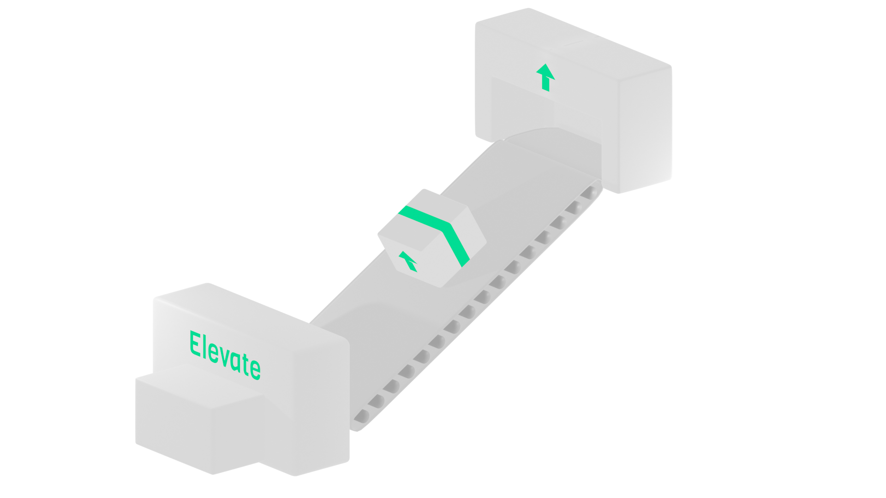

<div align="center">
    
</div>

# Elevate

Elevate the deployer can help you automate the deploying process to a remote endpoint. Common usecase might be pushing project to the remote VPS server.

## Installation (Linux)

You can just grab elevate by pasting the following bash line to your terminal 📦

```bash
curl -s https://raw.githubusercontent.com/Ph0enixKM/Elevate/master/installer.sh | bash
```

<div align="center">
 
</div>

## Compiling (MacOS/Windows)

For other platforms you can compile Elevate yourself, however it's really discouraged. Elevate needs bash environment to run properly.

1. Download [source file](https://github.com/Ph0enixKM/Elevate/archive/master.zip)

2. Install required dependencies `pip install -r requirements.txt`

3. Run `./start.sh`

4. Grab the compiled binary from `bin/` directory


## Usage

When firstly run - elevate will ask for the way you want to use it. For now there are 2 options available: *Client* and *Server*

If you made a mistake when configuring Elevate, you can easily reconfigure it by running `elevate config`

Running single `elevate` command will run default command:

```bash
elevate

# This is just the same as:
# Client:
elevate deploy
# Server:
elevate serve
```

- Client 🖥️
  
  - `elevate` - will try to find the **ele.vate** file in current directory and push your project to the remote endpoint specified in the file (the same behavior: *elevate deploy*) 
  
  - `elevate init` - will create **ele.vate** file in current directory and will ask you to specify remote endpoint (in order to connect to elevate with kind of **server**) 

- Server 📡
  
  - `elevate` - will serve and look for client connections on port specified in config. When connection is established - it will download new project and run it (the same behavior: *elevate serve*)

### Elevate project config file (.vate)

<div align="center">
 <br>
 <i>(Content of ele.vate file)</i>
</div>

Elevate project config file is divided into 3 parts.

1. **Client** *(Bash)* - this is where you decide what elevate should do with the project before pushing the files. Feel free to remove files that you don't need to push (like *node\_modules* for example). This part is being run **after** copying contents of this project to a new temporary directory. 

2. **Config** *(Json)* - here Elevate stores datailed information about what to upload and where to upload. Usually you don't have to edit this part of code, because project initing interface (`elevate init`) will prepare this part for you

3. **Server** *(Bash)* - this section contains script that will be run after project is being pushed to the server and unzipped. You can here install dependencies and reload the server if you wish. **Don't** use any commands that require user input or else the remote elevate will kill that process and send you error that your script timed out. Once the script finished running, you will see what it prompted.

> Useful note: when running the bash scripts your *pwd* is set to where the ele.vate is (which is the ele.vate in the new project). This file's directory is assumed as a root of your entire project.


